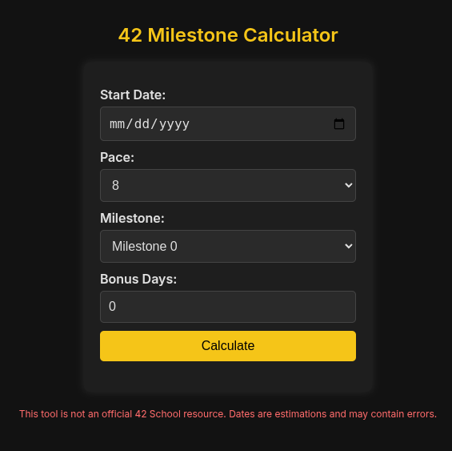

# 42 Milestone Calculator

## Overview

The **42 Milestone Calculator** is a web-based tool designed to help students at the 42 coding school estimate their progress through the curriculum based on their pace. This tool provides an easy way to calculate the deadlines for various milestones, ensuring that students stay on track and avoid the "blackhole" date—the critical deadline before which projects must be completed to avoid expulsion.

<div style="text-align: center;">
   
</div>

## How It Works

1. **Input Your Details:**
   - **Start Date:** Enter the date you started your curriculum.
   - **Pace:** Select your pace from the dropdown menu.
   - **Milestone:** Choose the milestone you want to calculate the deadline for.
   - **Bonus Days:** Enter any bonus days you have.

2. **Calculate:**
   - Click the "Calculate" button to see the estimated deadline for the selected milestone.

3. **Results:**
   - The tool will display the calculated deadline, helping you plan and manage your time effectively.

## Technology Stack

- **Frontend:** HTML, CSS, JavaScript
- **Design:** Modern, tech-inspired design with a dark color scheme and neon accents.
- **Hosting:** Can be hosted on any web server or platform like GitHub Pages, Netlify, etc.

## Installation

1. **Clone the Repository:**
   ```bash
   git clone https://github.com/yourusername/42-milestone-calculator.git
   ```

2. **Open the Project:**
   - Open the `index.html` file in your preferred web browser.

3. **Usage:**
   - Fill in the required fields and click "Calculate" to see the milestone dates.

## Features

### Milestone Calculation

The calculator allows you to input your start date, pace, milestone, and any bonus days to determine the deadline for each milestone. This helps in planning and managing your progress through the 42 curriculum.

### User-Friendly Interface

The interface is designed to be intuitive and easy to use, with clear labels and instructions for each input field.

### Customizable Pace

Choose from predefined paces (8, 12, 15, 18, 22, 24 months) to see how it affects your milestone deadlines.

### Bonus Days Support

Account for any additional days you might have earned, which can be crucial in adjusting your deadlines.

## Pace System Calculation

### Day Distribution

| Milestone | 8 mths | 12 mths | 15 mths | 18 mths | 22 mths | 24 mths |
|-----------|--------|---------|---------|---------|---------|---------|
| 0         | 8      | 13      | 18      | 24      | 30      | 45      |
| 1         | 24     | 35      | 42      | 48      | 58      | 73      |
| 2         | 22     | 33      | 41      | 49      | 60      | 60      |
| 3         | 36     | 53      | 67      | 80      | 98      | 128     |
| 4         | 51     | 77      | 96      | 115     | 141     | 141     |
| 5         | 71     | 107     | 134     | 162     | 197     | 197     |
| 6         | 32     | 47      | 59      | 70      | 86      | 86      |
| **Total** | (244 d)| (366 d) | (458 d) | (549 d) | (671 d) | (732 d) |

### Accumulative Days to Each Milestone

| Milestone | 8 mths | 12 mths | 15 mths | 18 mths | 22 mths | 24 mths |
|-----------|--------|---------|---------|---------|---------|---------|
| 0         | 8      | 13      | 18      | 24      | 30      | 45      |
| 1         | 32     | 48      | 60      | 72      | 88      | 118     |
| 2         | 54     | 81      | 101     | 121     | 148     | 178     |
| 3         | 90     | 134     | 168     | 201     | 246     | 306     |
| 4         | 141    | 211     | 264     | 316     | 387     | 447     |
| 5         | 212    | 318     | 398     | 478     | 584     | 644     |
| 6         | 244    | 365     | 457     | 548     | 670     | 730     |

## Contributing

Contributions are welcome! If you find any issues or have suggestions for improvements, please open an issue or submit a pull request.

## Disclaimer

This tool is not an official 42 School resource. The dates provided are estimations and may contain errors. Always verify with official 42 School guidelines.